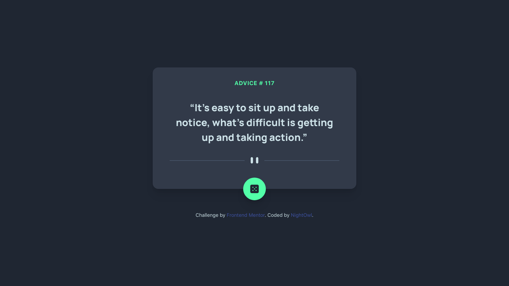

# Frontend Mentor - Advice generator app solution

This is a solution to the [Advice generator app challenge on Frontend Mentor](https://www.frontendmentor.io/challenges/advice-generator-app-QdUG-13db). Frontend Mentor challenges help you improve your coding skills by building realistic projects.

## Table of contents

- [Overview](#overview)
  - [The challenge](#the-challenge)
  - [Screenshot](#screenshot)
  - [Links](#links)
- [My process](#my-process)
  - [Built with](#built-with)
  - [What I learned](#what-i-learned)
  - [Useful resources](#useful-resources)
- [Author](#author)

## Overview

### The challenge

Users should be able to:

- View the optimal layout for the app depending on their device's screen size
- See hover states for all interactive elements on the page
- Generate a new piece of advice by clicking the dice icon

### Screenshot




### Links

- Solution URL: [solution-on-github](https://github.com/AMyintMyatAung/Frontend-Mentor-Challenges/tree/main/advice-generator-app)
- Live Site URL: [live-site-on-netlify](https://preeminent-begonia-07fe3c.netlify.app/advice-generator-app/index.html)

## My process

### Built with

- Semantic HTML5 markup
- CSS custom properties
- Flexbox
- Mobile-first workflow
- Vanilla Javascript
- Fetch API (JavaScript)
- [Tailwind](https://tailwindcss.com) - A utility-first CSS framework

### What I learned

I learned how to fetch resource from a server with **Fetch API** in JavaScript.

**Below is an example code for basic fetch request**
```Javascript
fetch("url")
  .then(response => response.json())
  .then(data => console.log(data));
```

***Did you know that the response object actually contains the represention of the entire HTTP response.***
That's why we have to extract the json body content using ```json()```.


### Useful resources

- [mdn-web-docs-using-fetch-api](https://developer.mozilla.org/en-US/docs/Web/API/Fetch_API/Using_Fetch) - Read more about using **Fetch API** on mdn
- [advice-slip-api](https://api.adviceslip.com) - API to generate advices
- [box-shadow.dev](https://box-shadow.dev/) - This helped me in generating similar box-shadow style like the given design
- [tailwind-cheat-sheet](https://nerdcave.com/tailwind-cheat-sheet) - This Tailwind cheat sheet helped me a lot while building this project due to its short but gets the point approach.
- [tailwind-documentation](https://tailwindcss.com/docs/) - The official documentation page of Tailwind CSS

## Author

- Github / [night_owl](https://github.com/AMyintMyatAung)
- Frontend Mentor / [@AMyintMyatAung](https://www.frontendmentor.io/profile/AMyintMyatAung)
