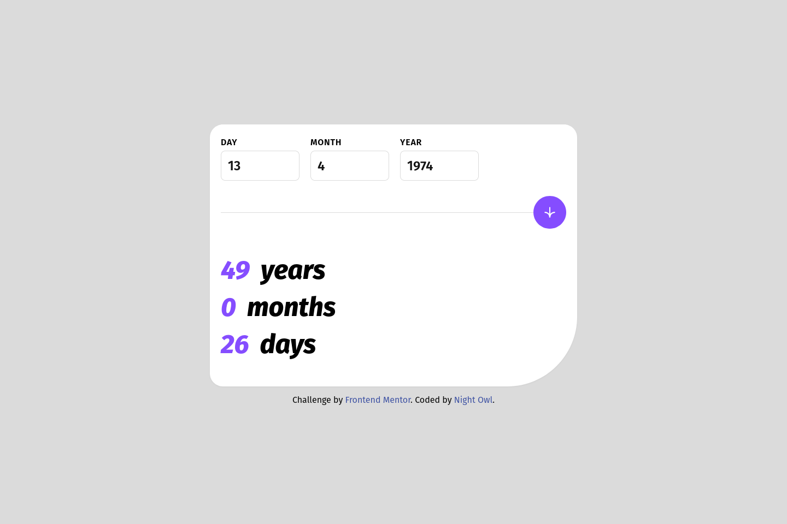

# Frontend Mentor - Age calculator app solution

This is a solution to the [Age calculator app challenge on Frontend Mentor](https://www.frontendmentor.io/challenges/age-calculator-app-dF9DFFpj-Q). Frontend Mentor challenges help you improve your coding skills by building realistic projects. 

## Table of contents

- [Overview](#overview)
  - [The challenge](#the-challenge)
  - [Screenshot](#screenshot)
  - [Links](#links)
- [My process](#my-process)
  - [Built with](#built-with)
  - [What I learned](#what-i-learned)
  - [Useful resources](#useful-resources)
- [Author](#author)
- [Acknowledgement](#acknowledgement)

## Overview

### The challenge

Users should be able to:

- View an age in years, months, and days after submitting a valid date through the form
- Receive validation errors if:
  - Any field is empty when the form is submitted
  - The day number is not between 1-31
  - The month number is not between 1-12
  - The year is in the future
  - The date is invalid e.g. 31/04/1991 (there are 30 days in April)
- View the optimal layout for the interface depending on their device's screen size
- See hover and focus states for all interactive elements on the page
- **Bonus**: See the age numbers animate to their final number when the form is submitted

### Screenshot

### Links

- Solution URL: [solution-on-github](https://github.com/AMyintMyatAung/Frontend-Mentor-Challenges/tree/main/age-calculator)
- Live Site URL: [live-site-on-netlify](https://preeminent-begonia-07fe3c.netlify.app/age-calculator/index.html)

## My process

### Built with

- Semantic HTML5 markup
- CSS custom properties
- Flexbox
- Vanilla JavaScript
- Mobile-first workflow
- [Tailwind](https://tailwindcss.com) - A utility-first CSS framework

### What I learned

ကျွန်တော်ဒီပရောဂျက်ကိုစလုပ်ကာစက ဟာ လွယ်လွယ်လေးခဏနဲ့ပြီးတယ်လို့ ဆိုပြီး ရေးလိုက်တာ မီးပျက်တာနဲ့၊ တခြားအကြောင်းတွေကြောင့် ၃ရက်၊ ၄ရက်လောက်ကြာသွားတယ်။ uiပိုင်းရေးတာ မကြာလိုက်ဘူး အသက်တွက်နည်းစဥ်းစားနေတာနဲ့ errorရှင်းတာမှာနည်းနည်းကြာသွားတာ။ တကယ်က အသက်တွက်နည်းကလည်းအလွယ်လေးကို ကျွန်တော်က အတွေးတွေပေါက်ပြီး အချိန်တွေကြာသွားတာ။ နောက်ဆုံး chat-gpt ကိုမေးမှပဲ သဘောပေါက်သွားပြီး အဆင်ပြေသွားတယ်။ ဘာပဲပြောပြော aiတွေကတော့ တစ်နေ့တစ်နေ့ပိုပိုစွမ်းလာတာကိုတော့ ကျွန်တော်တို့ငြင်းလို့မရတာ အမှန်ပဲ။

### Useful resources

- [mdn-date](https://developer.mozilla.org/en-US/docs/Web/JavaScript/Reference/Global_Objects/Date) - Read more about date() on mdn website
- [tailwind-cheat-sheet](https://nerdcave.com/tailwind-cheat-sheet) - This Tailwind cheat sheet helped me a lot while building this project due to its short but gets the point approach.
- [tailwind-documentation](https://tailwindcss.com/docs/) - The official documentation page of Tailwind CSS
- [calculate-age-in-days-months-years](https://www.omnicalculator.com/everyday-life/age-in-years-months-and-days) - Calculate the age in days, months and years
- [chat-gpt-by-openai](https://chat.openai.com/) -  A large language model developed by OpenAI, capable of generating human-like responses to various questions and prompts

## Author

- Github / [night_owl](https://github.com/AMyintMyatAung)
- Frontend Mentor / [@AMyintMyatAung](https://www.frontendmentor.io/profile/AMyintMyatAung)

## Acknowledgement

I referenced the age numbers animation from [number-counter-animation-in-pure-javascript] (https://codepen.io/Amaik/pen/ExaaLgE) by user [aakash] (https://codepen.io/Amaik). Thank you for this simple yet useful animation.