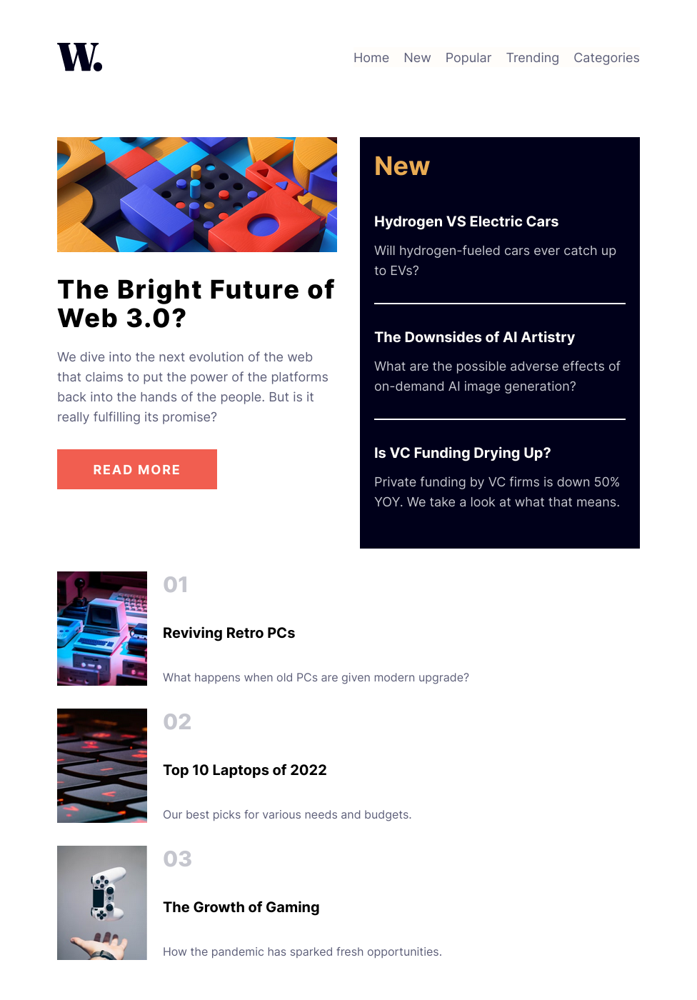

# Frontend Mentor - News homepage solution

This is a solution to the [News homepage challenge on Frontend Mentor](https://www.frontendmentor.io/challenges/news-homepage-H6SWTa1MFl). Frontend Mentor challenges help you improve your coding skills by building realistic projects. 

## Table of contents

- [Overview](#overview)
  - [The challenge](#the-challenge)
  - [Screenshot](#screenshot)
  - [Links](#links)
- [My process](#my-process)
  - [Built with](#built-with)
  - [What I learned](#what-i-learned)
  - [Continued development](#continued-development)
  - [Useful resources](#useful-resources)
- [Author](#author)

## Overview

### The challenge

Users should be able to:

- View the optimal layout for the interface depending on their device's screen size
- See hover and focus states for all interactive elements on the page

### Screenshot

**Preview of website at 1440x1240 px**

**Preview of website at 976x1400 px**

### Links

- Solution URL: [solution-on-github](https://github.com/AMyintMyatAung/Frontend-Mentor-Challenges/tree/main/news-homepage)
- Live Site URL: [live-site-on-netlify](https://main--preeminent-begonia-07fe3c.netlify.app/news-homepage/index.html)

## My process

### Built with

- Semantic HTML5 markup
- CSS custom properties
- Flexbox
- CSS Grid
- Mobile-first workflow
- [Tailwind](https://tailwindcss.com) - A utility-first CSS framework

### What I learned

I am more comfortable with using Flexbox but for this project just using Flexbox is not enough. So, I have to read more about Grid. And fortunately, I stumbled upon [this grid generator website](https://cssgrid-generator.netlify.app/) and it made creating layouts so much easier for me.

### Useful resources

- [cssgrid-generator](https://cssgrid-generator.netlify.app/) - Create any kind of layouts you want visually and then generate the css code for you
- [semantic-elements-html5-w3n](https://www.w3schools.com/html/html5_semantic_elements.asp) - Learn about HTML5 Semantic Elements on w3n
- [tailwind-cheat-sheet](https://nerdcave.com/tailwind-cheat-sheet) - This Tailwind cheat sheet helped me a lot while building this project due to its short but gets the point approach.
- [tailwind-documentation](https://tailwindcss.com/docs/) - The official documentation page of Tailwind CSS

## Author

- Github / [night_owl](https://github.com/AMyintMyatAung)
- Frontend Mentor / [@AMyintMyatAung](https://www.frontendmentor.io/profile/AMyintMyatAung)
