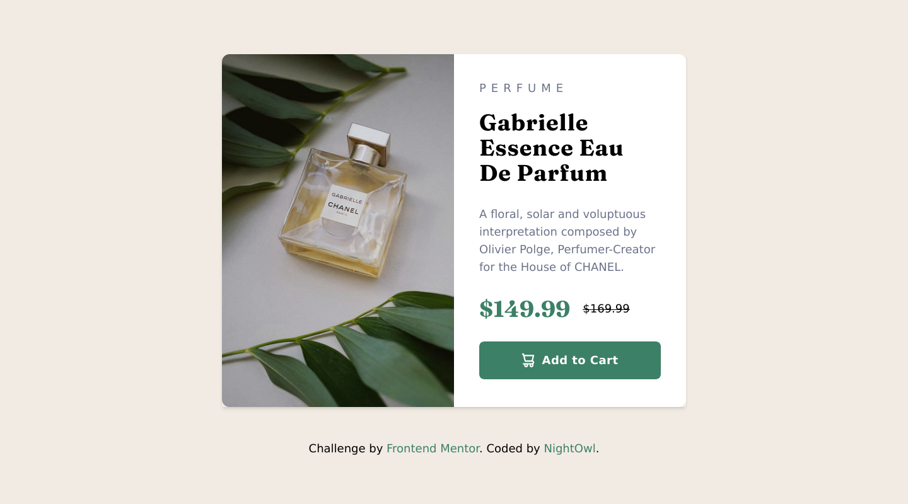

# Frontend Mentor - Product preview card component solution

This is a solution to the [Product preview card component challenge on Frontend Mentor](https://www.frontendmentor.io/challenges/product-preview-card-component-GO7UmttRfa). Frontend Mentor challenges help you improve your coding skills by building realistic projects.

## Table of contents

- [Overview](#overview)
  - [The challenge](#the-challenge)
  - [Screenshot](#screenshot)
  - [Links](#links)
- [My process](#my-process)
  - [Built with](#built-with)
  - [What I learned](#what-i-learned)
  - [Useful resources](#useful-resources)
- [Author](#author)

## Overview

### The challenge

Users should be able to:

- View the optimal layout depending on their device's screen size
- See hover and focus states for interactive elements

### Screenshot

### Links

- Solution URL: [solution-on-github](https://github.com/AMyintMyatAung/Frontend-Mentor-Challenges/tree/main/product-preview-card-component)
- Live Site URL: [live-site-on-netlify](https://main--preeminent-begonia-07fe3c.netlify.app/product-preview-card-component/index.html)

## My process

### Built with

- Semantic HTML5 markup
- Flexbox
- Mobile-first workflow
- Vanilla Javascript
- [Tailwind](https://tailwindcss.com) - A utility-first CSS framework

### What I learned

It's important to use semantic HTML in building websites. Due to its high SEO it'll be ranked higher in Search engine result pages and it'll also help screen reader users to access the site easier.

### Useful resources

- [semantic-elements-html5-w3n](https://www.w3schools.com/html/html5_semantic_elements.asp) - Learn about HTML5 Semantic Elements on w3n
- [tailwind-cheat-sheet](https://nerdcave.com/tailwind-cheat-sheet) - This Tailwind cheat sheet helped me a lot while building this project due to its short but gets the point approach.
- [tailwind-documentation](https://tailwindcss.com/docs/) - The official documentation page of Tailwind CSS

## Author

- Github / [night_owl](https://github.com/AMyintMyatAung)
- Frontend Mentor / [@AMyintMyatAung](https://www.frontendmentor.io/profile/AMyintMyatAung)
